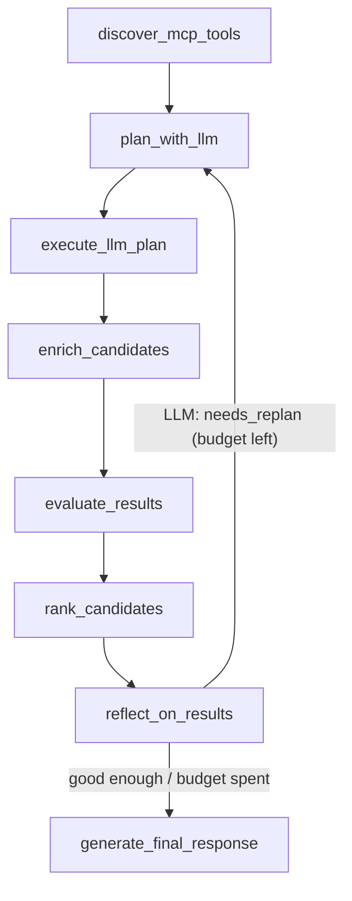
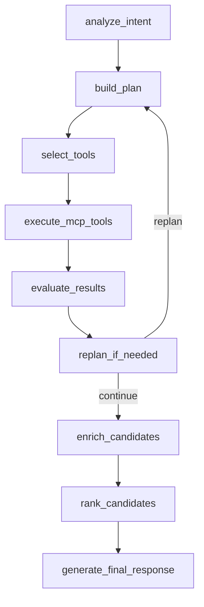

# LangGraph Agent Design

## Pattern

Use Plan-and-Execute with lightweight reflection.

Two workflow shapes coexist in `app/graph/workflow.py`:

- **LLM workflow** (`build_llm_workflow`) — the **primary real-mode**
  planner. The LLM receives the user query, discovered MCP tool names /
  descriptions / input schemas, and execution constraints; it returns a
  strictly-validated `LlmToolPlan`. LangGraph executes that plan with
  bounded fan-out for per-candidate enrichment.
- **Deterministic workflow** (`build_deterministic_workflow`) — the
  fallback used when `USE_LLM_PLANNER=false`, in mock mode, in tests,
  and when LLM credentials are not configured. It uses keyword
  heuristics and the prior plan-by-rules logic.

Reflection decides whether a **bounded** replan is needed. In the LLM workflow the **LLM makes that
decision** (`reflect_on_results`); in the deterministic fallback it is rule-based (`replan_if_needed`).
Neither path implements open-ended autonomous loops — both are hard-capped by `max_replan_attempts`.

## LLM Workflow



Key invariants:

- **Validation before execution.** `plan_with_llm` parses the LLM's
  JSON, validates each step against the live tool catalogue, drops
  steps with unknown tool names / extra inputs / missing required
  fields, and raises `LlmPlannerError` if nothing survives.
- **Bounded fan-out.** Steps with `depends_on` (e.g.
  `getCandidateDetail` after `searchCandidates`) execute at most
  `max_enrichments` times — once per candidate id returned by the
  prior tool. Fan-out results are merged into the existing
  `SearchResult` rather than appended as new candidates.
- **MCP-only execution.** No tool runs outside `McpClient.call_tool`.
- **LLM-driven, bounded replan.** After ranking, `reflect_on_results`
  asks the LLM (`LlmPlanner.reflect`) whether one more guided search
  pass is warranted; `should_replan_llm` loops back to `plan_with_llm`
  with the LLM's `guidance` (carried in `replan_feedback`). Guards make
  it bounded, never autonomous:
  - Hard cap `max_replan_attempts` (Settings, default 1, ≤3), checked
    before each reflection.
  - Cost gate: the reflection LLM call is skipped when results are
    already strong (a full match, or top score ≥ `replan_skip_score`).
  - Fail-safe: any reflection error ⇒ no replan.
  - Kill switch: `use_llm_replan=false` ⇒ single-shot.
  - `replan_feedback` is set only by `reflect_on_results` (under budget)
    and cleared by `plan_with_llm` on consumption, so the loop cannot
    spin. Re-runs **accumulate** candidates (executor de-dupes by
    `(source_tool, id)`) — a replan adds better-targeted profiles.

## Deterministic Workflow (fallback)



## Nodes

| Node | Responsibility |
| --- | --- |
| `analyze_intent` | Interpret the natural-language query and extract searchable intent, constraints, and ambiguity. |
| `build_plan` | Produce a bounded execution plan with clear steps and expected tool needs. |
| `select_tools` | Match plan steps to available MCP tools, preferring dynamically discovered tool metadata. |
| `execute_mcp_tools` | Execute selected MCP tools asynchronously, collect outputs, and normalize failures. |
| `evaluate_results` | Assess result quality, coverage, duplicates, confidence, and missing information. |
| `replan_if_needed` | Deterministic fallback only: decide whether to re-enter planning with bounded retries or proceed to final response. |
| `reflect_on_results` | LLM workflow only: ask the LLM whether the ranked results warrant one more guided, bounded replan; set `replan_feedback` under budget. |
| `generate_final_response` | Aggregate, rank, summarize, normalize MCP results, and produce the UI-oriented API response payload. |

## State Schema Proposal

The graph state should be represented with typed Pydantic models or typed dictionaries validated at boundaries.

| Field | Purpose |
| --- | --- |
| `original_query` | Raw user query. |
| `filters` | Optional structured filters from the request. |
| `interpreted_intent` | Extracted intent, entities, constraints, and ambiguity notes. |
| `execution_plan` | Ordered plan steps generated by the agent. |
| `available_tools` | MCP tools available to the workflow. |
| `selected_tools` | Tools chosen for the current plan. |
| `tool_calls` | Tool call history, inputs, status, latency, and sanitized errors. |
| `results` | Aggregated and normalized search results returned through MCP. |
| `summary` | Final user-facing explanation. |
| `confidence` | Numeric confidence from `0.0` to `1.0`. |
| `warnings` | User-safe warnings about partial results, ambiguity, or degraded execution. |
| `errors` | Internal structured errors for workflow control. |
| `replan_count` | Number of replanning attempts already used (hard-capped by `max_replan_attempts`). |
| `replan_feedback` | LLM reflection guidance for the next plan pass; non-empty = a bounded replan is pending. Set by `reflect_on_results`, consumed/cleared by `plan_with_llm`. |
| `ui_response` | Final frontend response containing `conversation_id`, `message`, and `ui`. |

## Transitions

- `analyze_intent` always moves to `build_plan` unless the request is invalid.
- `build_plan` moves to `select_tools` with a bounded plan.
- `select_tools` moves to `execute_mcp_tools`; missing tool matches become warnings or errors.
- `execute_mcp_tools` moves to `evaluate_results` with successful, partial, or failed tool outcomes.
- `evaluate_results` records quality signals and confidence.
- `replan_if_needed` either loops back to `build_plan` or proceeds to `generate_final_response`.

## Retry Strategy

- Retry only transient MCP client errors, timeouts, or rate-limit-style failures when safe.
- Do not retry validation errors or unsupported tool requests.
- Keep retry counts low and explicit.
- Record retries in `tool_calls` and warnings when they affect output quality.

## Replanning Conditions

In the **LLM workflow** the replan decision is the LLM's (`reflect_on_results`): it judges the
ranked candidates against the query and returns `needs_replan` + `guidance`. The conditions below
describe the intent the LLM is prompted to follow and the deterministic guardrails that bound it;
the **deterministic fallback** applies them as hard rules in `replan_if_needed`.

Replan only when:

- No useful results are returned.
- Results are too broad or clearly unrelated to the interpreted intent.
- A selected tool is unavailable and an alternate MCP tool exists.
- The query contains ambiguity that can be resolved by a narrower plan.

Do not replan when:

- The MCP server returns a validation error caused by invalid user input.
- Authentication or authorization fails.
- The maximum replan count has been reached.

## Error Propagation

- Preserve internal error detail for logs.
- Return user-safe errors and warnings in API responses.
- Surface partial results when useful and safe.
- Never expose secrets, raw credentials, or provider stack traces.
- Do not expose raw BoondManager MCP payloads to the frontend.

## Final Response Contract

The final API response should be UI-oriented:

```json
{
  "conversation_id": "conv_123",
  "message": "I found 5 candidates matching your search.",
  "ui": {
    "type": "candidate_cards",
    "candidates": []
  }
}
```

For candidate search results, `generate_final_response` maps MCP output to `ui.type = "candidate_cards"`.

Candidate card fields:

- `id`
- `full_name`
- `title`
- `experience_years`
- `location`
- `availability`
- `skills`
- `match_score`
- `summary`
- `boond_url`

The card values must be adapted from BoondManager MCP results. Missing scalar or numeric fields should be `null`; missing list fields should be `[]`. Do not invent candidate data. LLM-generated summaries are allowed only when grounded in MCP result fields.

## Internal Metadata

The graph may keep these values internally:

- `interpreted_intent`
- `execution_plan`
- `tool_calls`
- `confidence`
- `warnings`

They may be logged or exposed only in optional debug mode. They should not be the default frontend response.

## Future UI Types

Additional UI response types may be introduced later, such as:

- `mission_cards`
- `client_cards`
- `table`
- `clarification_request`
- `error_message`

Do not emit future UI types until the frontend supports them.
