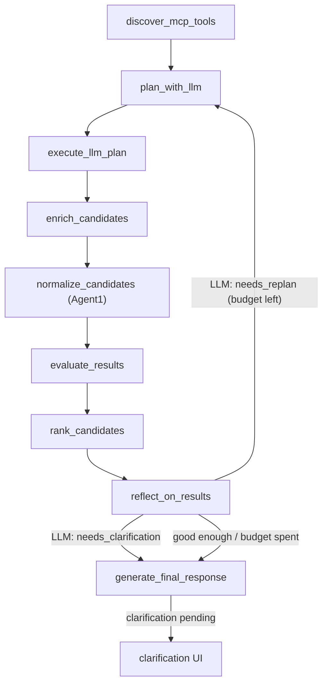
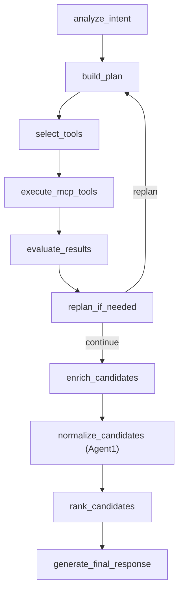

# LangGraph Agent Design

## Pattern

Use Plan-and-Execute with lightweight reflection.

Two workflow shapes coexist in `app/graph/workflow.py`:

- **LLM workflow** (`build_llm_workflow`) — the **primary real-mode**
  planner. The LLM receives the user query, discovered MCP tool names /
  descriptions / input schemas, and execution constraints; it returns a
  strictly-validated `LlmToolPlan`. LangGraph executes that plan with
  bounded fan-out for per-candidate enrichment.
- **Deterministic workflow** (`build_deterministic_workflow`) — the
  fallback used when `USE_LLM_PLANNER=false`, in mock mode, in tests,
  and when LLM credentials are not configured. It uses keyword
  heuristics and the prior plan-by-rules logic.

Reflection decides whether a **bounded** replan is needed. In the LLM workflow the **LLM makes that
decision** (`reflect_on_results`); in the deterministic fallback it is rule-based (`replan_if_needed`).
Neither path implements open-ended autonomous loops — both are hard-capped by `max_replan_attempts`.

## LLM Workflow



Key invariants:

- **Validation before execution.** `plan_with_llm` parses the LLM's
  JSON, validates each step against the live tool catalogue, drops
  steps with unknown tool names / extra inputs / missing required
  fields, and raises `LlmPlannerError` if nothing survives.
- **Bounded fan-out.** Steps with `depends_on` (e.g.
  `getCandidateDetail` after `searchCandidates`) execute at most
  `max_enrichments` times — once per candidate id returned by the
  prior tool. Fan-out results are merged into the existing
  `SearchResult` rather than appended as new candidates.
- **MCP-only execution.** No tool runs outside `McpClient.call_tool`.
- **LLM-driven, bounded replan.** After ranking, `reflect_on_results`
  asks the LLM (`LlmPlanner.reflect`) whether one more guided search
  pass is warranted; `should_replan_llm` loops back to `plan_with_llm`
  with the LLM's `guidance` (carried in `replan_feedback`). Guards make
  it bounded, never autonomous:
  - Hard cap `max_replan_attempts` (Settings, default 1, ≤3), checked
    before each reflection.
  - Cost gate: the reflection LLM call is skipped when results are
    already strong (a full match, or top score ≥ `replan_skip_score`).
  - Fail-safe: any reflection error ⇒ no replan.
  - Kill switch: `use_llm_replan=false` ⇒ single-shot.
  - `replan_feedback` is set only by `reflect_on_results` (under budget)
    and cleared by `plan_with_llm` on consumption, so the loop cannot
    spin. Re-runs **accumulate** candidates (executor de-dupes by
    `(source_tool, id)`) — a replan adds better-targeted profiles.
- **Reflect: accept / retry / clarify.** The same `reflect_on_results` call now
  picks one of three outcomes (the LLM decides). Besides accept and retry it may
  **ask the user to clarify** — used mainly when a query parameter could not be
  resolved (an unrecognised skill, an unknown location/company, contradictory
  or too-vague criteria). It returns `needs_clarification` + a
  `clarification_question` + `clarification_fields`; the node sets
  `GraphState.clarification_question` (clarification takes precedence over
  replan), the run finalizes, and `search_service` emits a `clarification` UI
  (rendered as a small form; the answers come back as an `interaction` and are
  merged into the next query). Guards: gated by the same reflection budget;
  off by `allow_clarification=false`; at most one clarification per request
  (`_already_clarified`); the criteria/warnings summary
  (`_reflection_criteria_summary`) tells the LLM what was unresolved.
- **In-session conversation memory.** For clarification (and follow-up refining)
  to work, the `/api/chat` layer accumulates the conversation's effective search
  query per `conversation_id` (`_combine_query`): a follow-up turn refines the
  prior request instead of restarting it (a bare "oui" adds nothing; duplicates
  are skipped). So answering a clarification keeps the original criteria. This
  state is in-memory and reset on new/deleted conversation — not persisted
  across process restarts.

## Deterministic Workflow (fallback)



## Nodes

| Node | Responsibility |
| --- | --- |
| `analyze_intent` | Interpret the natural-language query and extract searchable intent, constraints, and ambiguity. |
| `build_plan` | Produce a bounded execution plan with clear steps and expected tool needs. |
| `select_tools` | Match plan steps to available MCP tools, preferring dynamically discovered tool metadata. |
| `execute_mcp_tools` | Execute selected MCP tools asynchronously, collect outputs, and normalize failures. |
| `enrich_candidates` | Fan-out enrichment: per candidate, fetch detail, technical document, CV, and administrative data via MCP and merge them into the candidate's `data` under `_enrichment_*` keys. |
| `normalize_candidates` | **Agent1 — data-quality pass.** Pure-Python heuristics (no LLM, no I/O) that reconcile the same information across BoondManager structured fields, the technical document, and the CV, then write a normalised view into `result.data` under `_normalized_*` keys (experience years, skills, languages, title). See [Agent1](#agent1--candidate-data-normalisation). |
| `evaluate_results` | Assess result quality, coverage, duplicates, confidence, and missing information. |
| `replan_if_needed` | Deterministic fallback only: decide whether to re-enter planning with bounded retries or proceed to final response. |
| `reflect_on_results` | LLM workflow only: ask the LLM whether the ranked results warrant one more guided, bounded replan; set `replan_feedback` under budget. |
| `generate_final_response` | Aggregate, rank, summarize, normalize MCP results, and produce the UI-oriented API response payload. |

## State Schema Proposal

The graph state should be represented with typed Pydantic models or typed dictionaries validated at boundaries.

| Field | Purpose |
| --- | --- |
| `original_query` | Raw user query. |
| `filters` | Optional structured filters from the request. |
| `interpreted_intent` | Extracted intent, entities, constraints, and ambiguity notes. |
| `execution_plan` | Ordered plan steps generated by the agent. |
| `available_tools` | MCP tools available to the workflow. |
| `selected_tools` | Tools chosen for the current plan. |
| `tool_calls` | Tool call history, inputs, status, latency, and sanitized errors. |
| `results` | Aggregated and normalized search results returned through MCP. |
| `summary` | Final user-facing explanation. |
| `confidence` | Numeric confidence from `0.0` to `1.0`. |
| `warnings` | User-safe warnings about partial results, ambiguity, or degraded execution. |
| `errors` | Internal structured errors for workflow control. |
| `replan_count` | Number of replanning attempts already used (hard-capped by `max_replan_attempts`). |
| `replan_feedback` | LLM reflection guidance for the next plan pass; non-empty = a bounded replan is pending. Set by `reflect_on_results`, consumed/cleared by `plan_with_llm`. |
| `ui_response` | Final frontend response containing `conversation_id`, `message`, and `ui`. |

## Transitions

- `analyze_intent` always moves to `build_plan` unless the request is invalid.
- `build_plan` moves to `select_tools` with a bounded plan.
- `select_tools` moves to `execute_mcp_tools`; missing tool matches become warnings or errors.
- `execute_mcp_tools` moves to `evaluate_results` with successful, partial, or failed tool outcomes.
- `evaluate_results` records quality signals and confidence.
- `replan_if_needed` either loops back to `build_plan` or proceeds to `enrich_candidates`.
- `enrich_candidates` always moves to `normalize_candidates` (Agent1) before ranking, so the ranker and the card mapper read reconciled data rather than raw, incomplete BoondManager fields.

## Agent1 — Candidate Data Normalisation

`normalize_candidates` (module `app/agents/agent1/normalizer.py`) is a dedicated
**data-quality layer** that runs between enrichment and matching. Its single
responsibility is reconciling the same fact across the three available sources —
BoondManager structured fields, the technical document, and the CV text — and
writing a normalised view back into each `result.data`.

Agent1 has two passes:

1. A **deterministic pass** (always on) — pure-Python heuristics that produce
   the `_normalized_*` values and *detect conflicts* (`_normalized_conflicts`).
2. An optional **LLM reconciliation pass** (`app/agents/agent1/reconciler.py`,
   off by default) — only the candidates the deterministic pass flagged as
   incoherent are sent to an LLM that judges coherence across experience,
   skills, languages, and title. See [LLM reconciliation](#llm-reconciliation).

Design constraints of the deterministic pass:

- **Pure Python heuristics** — no LLM calls, no new I/O. All inputs already live
  in `result.data` from `enrich_candidates`.
- **Non-destructive** — the raw BoondManager payload is preserved untouched;
  Agent1 only *adds* `_normalized_*` keys.
- **Idempotent** — running it twice yields the same result.

Keys written into `result.data`:

| Key | Meaning |
| --- | --- |
| `_normalized_experience_years` | Best years-of-experience estimate. |
| `_normalized_experience_source` | Which source won: `cv`, `boondmanager`, `technical_document`, `profile_text`, `graduation`, or `llm`. |
| `_normalized_skills` | Deduplicated union of skills (structured + free-text). |
| `_normalized_languages` | Deduplicated union of languages (structured + CV). |
| `_normalized_title` | Best job-title estimate. |
| `_normalized_conflicts` | List of detected coherence-conflict reasons (internal; never surfaced on the card). |

### Experience resolution

Priority order:

1. **A clearly-stated CV figure wins** — a number explicitly tied to an
   experience keyword in the CV ("16 ans d'expérience", "3+ years of hands-on
   technical experience"). Source `cv`.
2. Structured BoondManager `experienceMinYears`. Source `boondmanager`.
3. The recruiter-set **experience level**, parsed from its resolved label
   (`_experienceLabel` → years, e.g. "3 ans" → 3, "> à 10 ans" → 10, "Pas
   d'expérience" → 0). Source `experience_level`. Using it (not ignoring it)
   keeps the card and the ranking score on the SAME value.
4. Experience-qualified figures from the technical document, then the profile
   title/snippet. Sources `technical_document` / `profile_text`.

Curated sources (`cv`, `boondmanager`, `experience_level`) are never
auto-overridden by the graduation estimate; a disagreement only raises a
conflict for the LLM to arbitrate. The graduation estimate replaces the value
only when nothing else exists, or when the value came from a shaky text-mined
source (`technical_document` / `profile_text`).

Free-text mining only counts a number **explicitly tied to an experience
keyword** in the same clause; the high-precision "keyword: number" form is
tried first and the gap is digit-free, so an age ("40 ans"), a duration
("4 years of data"), company history, or an age line sitting next to an
experience line are never mis-read. Values are capped at 50 years.

**Graduation fallback.** Agent1 estimates years from the **graduation year**
(`current_year − latest graduation end year`, taken from technical-document
diplomas/training or the CV's education section; a "2017-2020" range uses the
end year) in two cases:

1. the data is *conflicting* (`_normalized_conflicts` non-empty) **and** no
   figure was explicitly stated in the CV — an objective anchor instead of a
   misread number; or
2. **no experience figure exists anywhere** **and** there is no structured
   experience-level band to display — so the card shows an estimate rather than
   nothing.

Source `graduation`. A curated experience-level band (case 2's exclusion) is
always preferred over an estimate, and if no graduation year is found the prior
deterministic value is kept.

**Cross-checks (comparison only).** The graduation estimate and the sum of the
CV's per-role durations (`_sum_experience_durations`, e.g. "(4 ans 10 mois)" +
"(2 ans 2 mois)" …) are computed for every candidate and compared against the
resolved experience. A divergence ≥ 3 years raises a conflict
(`experience_vs_graduation_disagreement` / `experience_vs_duration_disagreement`)
so the discrepancy surfaces (and feeds LLM reconciliation when enabled). The
duration sum is a *signal only* — it never becomes the displayed value — since
simultaneous roles can be double-counted.

### Skills & languages

- Skills come from BoondManager structured fields first, then from the technical
  document and CV free text matched against the shared `KNOWN_SKILL_PATTERNS`
  table. Comma/newline-separated `skills` strings are split into individual tags
  (no giant blob), and overly long tokens (sentences) are dropped.
- Languages come from structured fields, supplemented by language mentions
  detected in the CV (with level qualifiers when present).

### LLM reconciliation

The deterministic pass is fast and reliable but rigid: every tricky case (an age
"40 ans" sitting next to "16 ans d'expérience") must be anticipated in code. The
optional LLM layer adds **non-deterministic decisional flexibility** for exactly
those cases, while keeping the deterministic result as the baseline/fallback.

How it works:

1. The deterministic pass records conflict reasons in `_normalized_conflicts`,
   e.g. `age_present_with_experience`, `experience_multiple_figures`,
   `experience_vs_structured_disagreement`, `title_seniority_mismatch`,
   `experience_vs_graduation_disagreement` (the resolved years disagree with the
   graduation-year estimate), `experience_vs_duration_disagreement` (they
   disagree with the sum of the CV's per-role durations).
2. In the `normalize_candidates` node, **only the conflicting candidates** are
   sent to the reconciler — coherent candidates skip the LLM entirely (zero
   cost in the common case). All conflicting candidates go in **one batched
   call** per search.
3. The LLM receives the grounded text (CV, technical document, title) plus the
   deterministic values, and returns a validated JSON `Agent1Judgement` per
   candidate with a `confidence`. It is instructed to never invent data and to
   distinguish experience from age / durations.
4. A judgement overrides the deterministic value **only when `confidence ≥
   `settings.agent1_confidence_threshold`** (default 0.6); the winning
   experience source is then `llm`.

Guardrails:

- **Off by default** (`AGENT1_LLM_RECONCILIATION=false`); Agent1 stays purely
  deterministic until enabled.
- **Fail-safe** — any LLM/parse/validation error returns no judgements, so the
  deterministic result is kept (`Agent1Reconciler.reconcile` never raises).
- **Bounded** — capped at `agent1_max_reconcile_candidates` per search; CV/tech
  texts are truncated before sending.
- **Determinism trade-off** — by design this pass is non-deterministic on
  conflicting candidates only; tests mock the `ChatFn`, so the deterministic
  suite stays stable.

### Surfacing in the frontend card

The card mapper (`candidate_mapper.py`) strips every `result.data` key starting
with `_` unless it is whitelisted. Agent1's `_normalized_*` keys are therefore
listed in `_SAFE_INTERNAL_FIELDS` and consumed by `_first_number`
(experience), `_extract_skills`, and `_extract_languages`. **Any new
`_normalized_*` key must be both whitelisted there and read by the relevant
extractor, or it will never reach the card.** (`_normalized_conflicts` is
deliberately *not* whitelisted — it is internal-only and never shown.)

### Shared skill patterns & import boundary

`KNOWN_SKILL_PATTERNS` lives in the dependency-free module `app/skill_patterns.py`
and is imported by both `candidate_mapper.py` and Agent1. It is kept outside
`app.services` on purpose: importing it from `app.services.candidate_mapper`
would trigger `app.services.__init__` → `search_service` → `graph.nodes` →
Agent1, creating a circular import.

## Experience range & seniority cap

The ranking models experience as a **range**, not just a floor. `analyze_intent`
(and the LLM planner) populate two constraints:

- `min_experience_years` — a floor (`senior`, `5+ ans`, `au moins 5 ans`).
- `max_experience_years` — a cap (`junior`, `moins de 3 ans`, `up to 2 years`).

A bare seniority word maps to a band when no number is given: **junior ≤ 2,
confirmed 3-5, senior ≥ 5** (`extract_experience_bounds`). A range like
`0-2 ans` sets both bounds.

In `evidence_score`, the seniority dimension is credited only when the
candidate's known years sit **within the requested band**. A candidate whose
*known* experience exceeds the cap (e.g. a 7-year profile for a "junior 0-2 ans"
search) loses the seniority credit **and** the final score is multiplied by
`_OVER_CAP_PENALTY` (0.4) — so it drops far down the ranking but stays visible
rather than being excluded. Unknown experience is never hit by the cap
multiplier (we only penalise a known over-cap value).

## Recall ladder (search retrieval)

`searchCandidates` is a recall tool whose keyword search **unions** terms and
ranks by relevance. `build_recall_passes` (`app/services/search_strategy.py`)
turns the interpreted anchors into a bounded, keyword-only ladder:

1. **name** (if a person is named) — strongest anchor, searched first.
2. **combined** — the discriminating *content* anchors (domains/company +
   skills) joined into ONE keyword query (e.g. "amundi java"). Because the
   engine unions and ranks by relevance, candidates matching the most terms
   surface at the top — far better recall than searching a generic skill alone.
   **Generic role/seniority words are deliberately excluded** from this union:
   in full-text they are noisy ("tech lead" pulls unrelated infra profiles).
   Built only when there are ≥2 content anchors.
3. **primary / role (titleSkills, title) / domain / remaining skills** — the
   single-term relaxation passes, used as fallback.

The ladder stops at the first pass that returns candidates (then complements it
with a `titleSkills` pass). Page size is `numberPerPage` (≈40) so the ranker has
enough candidates to work with — too small a page silently drops matching
profiles ranked just outside the top-N by the provider. Role/seniority and the
other criteria are applied in **ranking** (`evidence_score`), not as hard
retrieval filters (structured id filters can kill recall).

## Retry Strategy

- Retry only transient MCP client errors, timeouts, or rate-limit-style failures when safe.
- Do not retry validation errors or unsupported tool requests.
- Keep retry counts low and explicit.
- Record retries in `tool_calls` and warnings when they affect output quality.

## Replanning Conditions

In the **LLM workflow** the replan decision is the LLM's (`reflect_on_results`): it judges the
ranked candidates against the query and returns `needs_replan` + `guidance`. The conditions below
describe the intent the LLM is prompted to follow and the deterministic guardrails that bound it;
the **deterministic fallback** applies them as hard rules in `replan_if_needed`.

Replan only when:

- No useful results are returned.
- Results are too broad or clearly unrelated to the interpreted intent.
- A selected tool is unavailable and an alternate MCP tool exists.
- The query contains ambiguity that can be resolved by a narrower plan.

Do not replan when:

- The MCP server returns a validation error caused by invalid user input.
- Authentication or authorization fails.
- The maximum replan count has been reached.

## Error Propagation

- Preserve internal error detail for logs.
- Return user-safe errors and warnings in API responses.
- Surface partial results when useful and safe.
- Never expose secrets, raw credentials, or provider stack traces.
- Do not expose raw BoondManager MCP payloads to the frontend.

## Final Response Contract

The final API response should be UI-oriented:

```json
{
  "conversation_id": "conv_123",
  "message": "I found 5 candidates matching your search.",
  "ui": {
    "type": "candidate_cards",
    "candidates": []
  }
}
```

For candidate search results, `generate_final_response` maps MCP output to `ui.type = "candidate_cards"`.

Candidate card fields:

- `id`
- `full_name`
- `title`
- `experience_years`
- `location`
- `availability`
- `skills`
- `match_score`
- `summary`
- `boond_url`

The card values must be adapted from BoondManager MCP results. Missing scalar or numeric fields should be `null`; missing list fields should be `[]`. Do not invent candidate data. LLM-generated summaries are allowed only when grounded in MCP result fields.

## Internal Metadata

The graph may keep these values internally:

- `interpreted_intent`
- `execution_plan`
- `tool_calls`
- `confidence`
- `warnings`

They may be logged or exposed only in optional debug mode. They should not be the default frontend response.

## Future UI Types

Additional UI response types may be introduced later, such as:

- `mission_cards`
- `client_cards`
- `table`
- `clarification_request`
- `error_message`

Do not emit future UI types until the frontend supports them.
