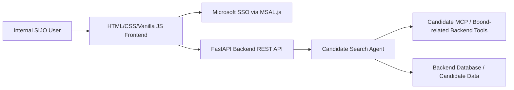
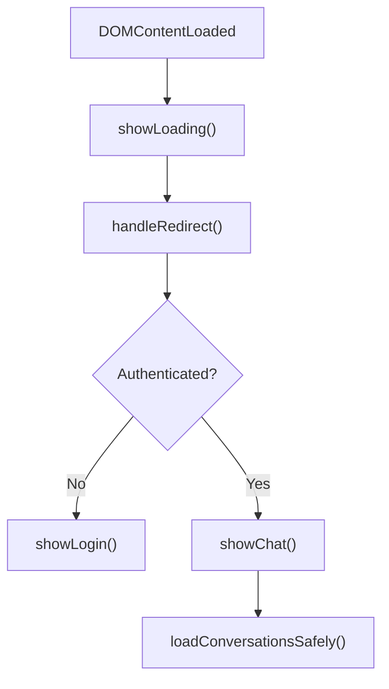
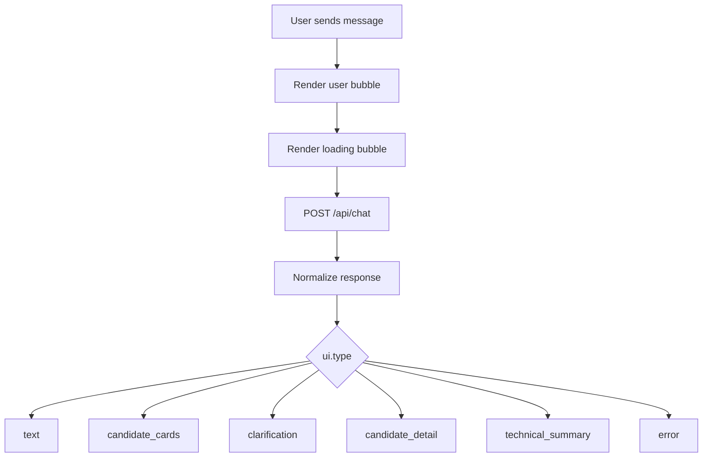

# Architecture

## Overview

SIJO Assistant Frontend is a static vanilla JavaScript application that talks only to a FastAPI backend.

The frontend never calls MCP, OpenAI, or BoondManager APIs directly.

## Main Layers

### `index.html`

Defines the static shell:

- Login screen
- Loading screen
- Sidebar
- Header
- Chat area
- Input area
- Candidate drawer

### `style.css`

Defines the complete visual system:

- SIJO layout
- Login and loading screens
- Chat bubbles
- Candidate cards
- Clarification forms
- Candidate detail and technical summary cards
- Candidate drawer
- Responsive behavior

### `config.js`

Centralizes:

- API base URL
- Development mode
- API endpoints
- Feature flags
- UI messages
- Candidate display settings

### `msalConfig.js`

Contains Microsoft SSO public configuration placeholders.

No client secret is stored in the frontend.

### `auth.js`

Owns authentication:

- `handleRedirect()`
- `login()`
- `logout()`
- `getCurrentUser()`
- `getAccessToken()`
- `isAuthenticated()`

In `DEV_MODE`, MSAL is bypassed.

### `api.js`

Owns backend communication:

- Builds endpoints from configuration.
- Adds authorization headers.
- Applies timeout on `/api/chat`.
- Validates and normalizes chat responses.
- Keeps development mock responses.

### `app.js`

Owns UI orchestration:

- Startup flow
- Authentication state display
- Conversation loading
- Sending chat messages
- Rendering assistant responses by `ui.type`
- Candidate drawer behavior
- Clarification submission

## Startup Flow

The UI must never leave both login and chat hidden.

## Chat Flow

## State Ownership

The backend owns:

- Conversation memory
- Candidate search intent
- Filters
- Tool usage
- Candidate retrieval
- Candidate technical analysis

The frontend owns:

- Current UI state
- Current conversation ID
- Current open candidate drawer
- Rendering only

