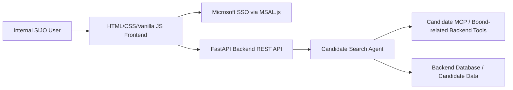
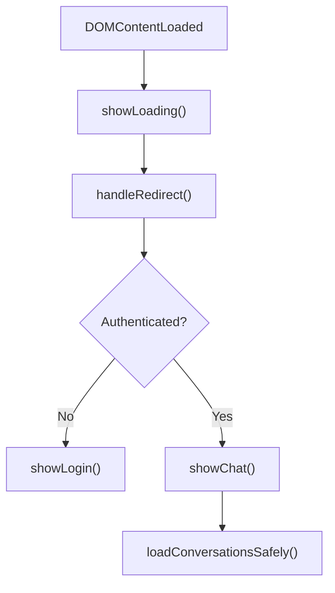
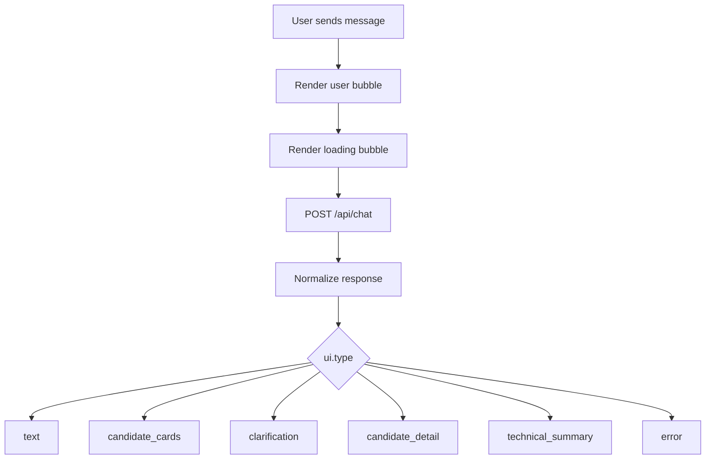

# Architecture

## Overview

SIJO Assistant Frontend is a vanilla JavaScript application built with Vite and served as static files. It talks only to a FastAPI backend.

The frontend never calls MCP, OpenAI, or BoondManager APIs directly.

## Main Layers

### `index.html`

Defines the static shell:

- Login screen
- Loading screen
- Sidebar
- Header
- Chat area
- Input area
- Candidate drawer

Vite uses this file as the application entry point during development and production builds.

### `style.css`

Defines the complete visual system:

- SIJO layout
- Login and loading screens
- Chat bubbles
- Candidate cards
- Candidate result summary and lightweight visual controls
- Clarification forms
- Candidate detail and technical summary cards
- Candidate drawer
- Responsive behavior

### `config.js`

Centralizes:

- API base URL
- Development mode
- API endpoints
- Feature flags
- UI messages
- Candidate display settings

### `package.json` and `vite.config.js`

Provide Node.js development and build tooling.

- `npm run dev` starts the local frontend server on `http://localhost:5500`.
- `npm run build` generates static deployable files in `dist/`.
- `npm run preview` previews the production build.

### `msalConfig.js`

Contains Microsoft SSO public configuration placeholders.

No client secret is stored in the frontend.

### `auth.js`

Owns authentication:

- `handleRedirect()`
- `login()`
- `logout()`
- `getCurrentUser()`
- `getAccessToken()`
- `isAuthenticated()`

In `DEV_MODE`, MSAL is bypassed.

### `api.js`

Owns backend communication:

- Builds endpoints from configuration.
- Adds authorization headers.
- Applies timeout on `/api/chat`.
- Validates and normalizes chat responses.
- Keeps development mock responses.

### `app.js`

Owns UI orchestration:

- Startup flow
- Authentication state display
- Conversation loading
- Sending chat messages
- Rendering assistant responses by `ui.type`
- Rendering enriched candidate cards, AI evaluations, highlights, recent
  experiences, diplomas, domains, tools, languages, and resolved metadata
- Candidate drawer behavior
- Clarification submission

## Startup Flow

The UI must never leave both login and chat hidden.

## Chat Flow

For `candidate_cards`, the frontend can render optional search summary fields
(`ui.title`, `ui.subtitle`, `ui.filters_summary`) before the cards. It can also
apply lightweight local display controls such as sorting already received
candidates by match score or hiding profiles that are not already marked as
available.

Candidate cards and the drawer may also render backend-normalized profile
details such as `state_label`, `mobility`, `technical_summary`, `diplomas`,
`expertise_areas`, `activity_areas`, `tools`, `languages`, `source`, and
`last_update`. These values are display-only and must come from the backend.

These controls do not replace backend filtering and do not construct
BoondManager queries.

## State Ownership

The backend owns:

- Conversation memory
- Candidate search intent
- Filters
- Tool usage
- Candidate retrieval
- Candidate technical analysis

The frontend owns:

- Current UI state
- Current conversation ID
- Current open candidate drawer
- Rendering only
- Lightweight display-only sorting/filtering of already received candidate cards
- Empty reserved header identity slot until real user identity display is ready

The frontend must not own:

- Candidate search business rules
- BoondManager query construction
- MCP tool selection
- Candidate creation or modification
