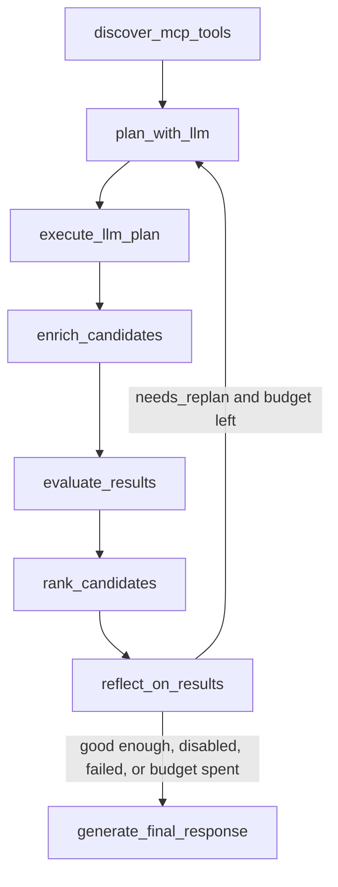

# Target Control Loop Spec

## Headline

Architectural Paradigm Shift: From Single-Shot Planning to Bounded ReAct Control Loop

## Target Loop

The target LLM workflow is:

```text
discover tools
-> plan with LLM
-> validate plan
-> act through MCP
-> observe normalized/ranked results
-> reflect with LLM
-> replan with guidance or stop
-> final response
```

## State Machine



## Loop Signal

`GraphState.replan_feedback` is the only loop signal.

- It is set only by `reflect_on_results`.
- It is set only when the LLM returns `needs_replan=true` with non-empty `guidance`.
- It is consumed and cleared by `plan_with_llm`.
- `should_replan_llm` routes back to `plan_with_llm` only while this field is non-empty.

## Bounds

- `max_replan_attempts` is the hard cap on extra LLM-guided search passes.
- `use_llm_replan=false` disables the loop.
- `replan_skip_score` skips reflection when results are already strong.
- A full candidate match skips reflection.
- Reflection errors or malformed JSON resolve to no replan.

## Stop Conditions

The loop stops when any of these is true:

- The LLM says `needs_replan=false`.
- The LLM returns no concrete guidance.
- The maximum replan count has been reached.
- The loop is disabled by configuration.
- The current ranked results are already strong.
- Reflection fails, times out, or cannot be parsed.
- Planning after feedback produces no valid tool plan.

## Event Flow

The stream remains user-safe and product-level.

Expected event pattern when a replan happens:

```text
search_started
tools_discovered
plan_created
plan_validated
tool_call_started
tool_call_completed
results_normalized
candidate_cards_partial
replan_requested { decided_by: "llm", replan_count: N, reason, guidance }
plan_created
plan_validated
tool_call_started
tool_call_completed
results_normalized
candidate_cards_partial
final_response
```

The stream must never expose chain-of-thought, raw MCP payloads, raw BoondManager payloads, secrets, stack traces, or private debug objects.
