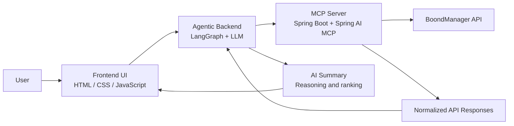
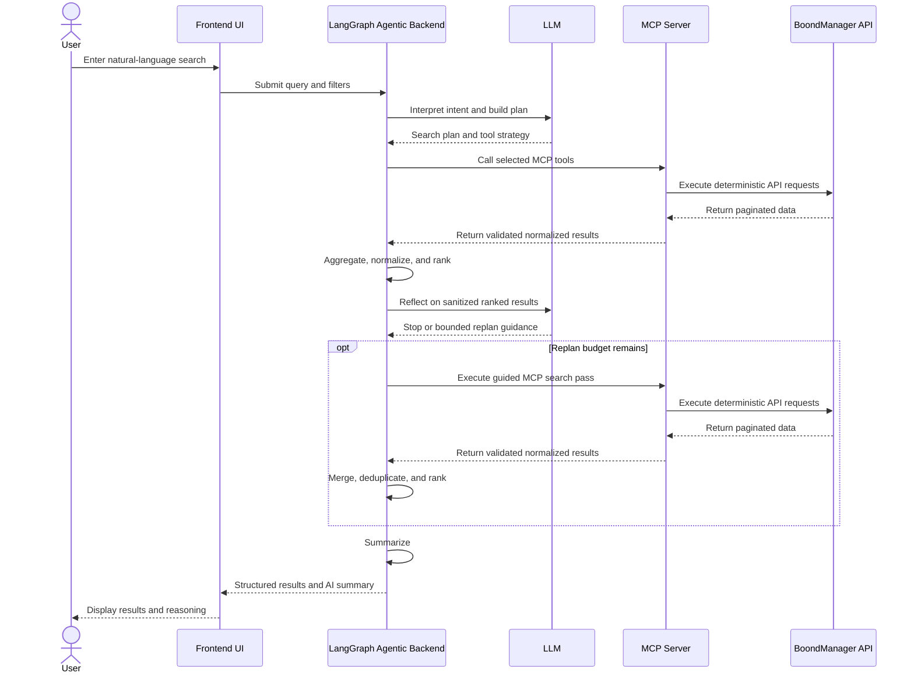
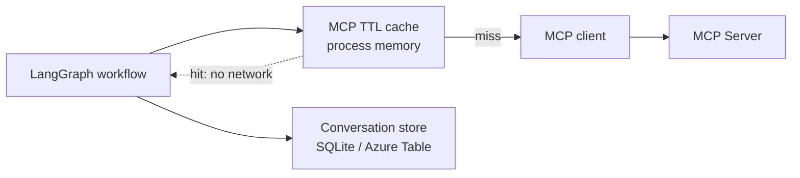

# Sijo AI Agent Architecture

## Purpose

This document describes the target architecture for Sijo's internal AI Agent project.

The goal is to let users perform deep and advanced searches on BoondManager data using natural language. The system connects an LLM-powered agent to BoondManager through an MCP server, while keeping business data access deterministic, auditable, and easy to evolve.

## Scope

The architecture covers three main parts:

- A simple frontend UI for entering search criteria and displaying results.
- An agentic backend built with LangGraph and connected to an LLM.
- An MCP server built with Spring Boot and Spring AI MCP Server Starter, exposing BoondManager capabilities as tools.

The MCP server should remain deterministic and non-intelligent. Reasoning, planning, ranking, and summarization belong in the agentic backend.

## High-Level Architecture



## Request Flow



The diagram above shows every MCP call reaching BoondManager. In
practice a TTL cache sits at the Agent API's MCP client boundary, so
calls for semi-stable data (the reference dictionary, CV text,
technical documents) are served locally on repeat — see
[Caching And Persistence](#caching-and-persistence).

## Cost Profile Of One Search

Concrete orders of magnitude matter here, because the expensive part of
the system is not the LLM — it is the fan-out of MCP calls:

| Step | Calls |
| --- | --- |
| Tool discovery | 1 MCP call (cached, 5 min) |
| Planning | 1 LLM call |
| Recall ladder | 1-5 `searchCandidates` passes + 1 title pass |
| Dictionary resolution | up to 3 `getDictionary` calls (cached, 6 h) |
| Enrichment | up to 4 MCP calls x 12 candidates |
| Agent1 reconciliation | 0-1 LLM call (off by default) |
| Reflection | 0-1 LLM call (skipped when results are strong) |
| Bounded replan | replays the block above, at most once |

Roughly **55-60 MCP calls and 1-3 LLM calls** for a full uncached
search. Two deliberate consequences follow: enrichment is capped at one
UI page's worth of candidates (12) to bound latency, and follow-up
turns ("more", "filter", "sort") are answered from session memory
without any external call at all.

## Agent Control Loop

The Agent API is migrating from a single-shot plan-and-execute workflow to a bounded ReAct-style control loop:

```text
plan -> act through MCP -> observe sanitized results -> reflect -> replan or stop
```

This is not an open-ended autonomous ReAct loop. The LLM owns planning and bounded replan decisions, while LangGraph owns validation, state transitions, loop caps, and MCP-only execution. The transition is tracked in [Architectural Paradigm Shift: From Single-Shot Planning to Bounded ReAct Control Loop](../architecture-transitions/bounded-react-control-loop/README.md).

## Caching And Persistence

Three storage layers coexist in the Agent API and are easy to confuse.
They differ in lifetime, scope, and what losing them costs.



| Layer | Backing | Lifetime | Losing it costs |
| --- | --- | --- | --- |
| Conversation history | SQLite (dev) or Azure Table (prod) | Permanent, scoped per user | Real user data — it is the one durable store |
| MCP result cache | Process memory. **Not a database.** | TTL-bounded, cleared on restart | Latency only; the next call refetches |
| CV vector index | SQLite or Azure Table | Permanent but derived | Re-indexing time only — see [Semantic Retrieval](#semantic-retrieval-evaluated-not-adopted) |

### MCP result cache

Decorator around the MCP client ([ADR-013](../decisions/adr-013-mcp-result-caching.md)),
so no graph node knows it exists. What it caches, and what it
deliberately does not:

- **Cached** — `getDictionary` (quasi-static reference data, fetched up
  to three times per request), `getCandidateCV` and
  `getCandidateTechnicalDocument` per candidate id (each CV call makes
  BoondManager download and re-extract a PDF), and the tool catalogue.
- **Never cached** — `searchCandidates`, `getCandidateDetail`,
  `getCandidateAdministrative`. These carry availability, pipeline
  state, and rates: serving them stale could surface a candidate who
  has already been placed.

Errors and empty results always pass through uncached, so a failed call
is retried normally and a candidate who uploads a CV becomes visible on
the next search rather than after a full TTL window.

The cache is **per process**: replicas each warm their own and a restart
clears it. A shared cache (Redis, or Azure Table through the existing
storage factory) is the natural next step if replica count grows, and is
deliberately out of scope today.

### Semantic Retrieval (evaluated, not adopted)

A vector index over candidate CVs was built and measured as a second
recall channel alongside `searchCandidates` (ADR-014, on branch
`feature/agent-api-cv-rag` — not merged, so the ADR is not in this
tree). A/B measurement over the fully indexed base — 24 313 candidates,
indexed with zero failures — found **no measurable benefit**: 7 of 8
queries returned identical results with and without it.

The reason is worth recording, because it constrains future retrieval
work: `searchCandidates` defaults to `keywordsType=resumeTd` — resume
plus technical document — so BoondManager **already full-text searches
CV content**. The premise that CV text was unreachable was wrong.
Combined with the recall ladder and evidence scoring, the existing path
already reaches the profiles a vector channel would surface.

The work is parked, not deleted, and reactivable by one environment
variable if a concrete recall gap ever appears.

## Component Responsibilities

### Frontend UI

Responsibilities:

- Provide a simple search interface for user criteria.
- Send natural-language queries and optional filters to the backend.
- Display structured search results.
- Display AI-generated summary, reasoning, and ranking notes.
- Handle loading, empty states, and user-facing errors.

Non-goals:

- No direct BoondManager API access.
- No LLM orchestration.
- No business logic beyond basic form validation and presentation.

### Agentic Backend

Responsibilities:

- Receive user intent from the frontend.
- Use LangGraph to manage agent state and execution flow.
- Connect to an LLM for intent understanding, planning, bounded reflection, and summarization.
- Select the appropriate MCP tools.
- Execute tool calls through the MCP server.
- Cache semi-stable MCP results, and refuse to cache volatile ones.
- Persist per-user conversation history and rehydrate a session after a restart.
- Aggregate, rank, deduplicate, and summarize results.
- Return both structured data and a concise explanation.

Non-goals:

- No direct BoondManager API integration.
- No hidden data transformation that should belong to the MCP normalization layer.
- No caching of data whose staleness could mislead a recruiter.

### MCP Server

Responsibilities:

- Expose BoondManager endpoints as MCP tools.
- Handle BoondManager authentication.
- Validate tool inputs.
- Manage pagination and API limits.
- Normalize BoondManager responses into stable schemas.
- Return clear deterministic errors.
- Keep tool behavior predictable and testable.

Non-goals:

- No LLM calls.
- No autonomous reasoning.
- No ranking, summarization, or intent interpretation.

## Tool Boundary

The MCP tools should be narrow, explicit, and stable. Example tool categories:

- Search candidates, consultants, resources, companies, contacts, opportunities, and projects.
- Retrieve entity details by ID.
- Search by skills, availability, role, location, seniority, status, or date ranges.
- Resolve related entities, such as candidate-to-company or project-to-contact relationships.

Each tool should define:

- Input schema.
- Required and optional filters.
- Pagination behavior.
- Normalized output schema.
- Error format.

## Example User Queries

- "Find Java developers in Paris who are available within the next month."
- "Show consultants with React and Node.js experience who worked on banking projects."
- "Find active opportunities requiring a senior project manager in Lyon."
- "Which candidates match a data engineer role with Python, SQL, and Azure?"
- "Summarize the best available profiles for this client need."
- "Find companies with recent opportunities related to cybersecurity."
- "Compare the top five matching consultants and explain the ranking."

## Suggested Repository Structure

```text
.
├── docs/
│   ├── architecture/        # this document
│   ├── decisions/           # ADRs
│   ├── milestones/
│   └── mcp-tools/
├── apps/
│   ├── web-ui/              # static frontend, Vite + MSAL (Entra SSO)
│   ├── agent-api/           # FastAPI + LangGraph — all reasoning
│   │   ├── app/
│   │   │   ├── api/         # thin routers
│   │   │   ├── graph/       # LangGraph nodes and workflows
│   │   │   ├── agents/      # Agent1 data normalisation
│   │   │   ├── mcp/         # MCP client + TTL caching decorator
│   │   │   ├── services/    # search orchestration, ranking, mapping
│   │   │   ├── storage/     # conversation persistence
│   │   │   ├── session/     # in-process session memory, rehydration
│   │   │   ├── models/
│   │   │   └── config/
│   │   ├── scripts/
│   │   └── tests/
│   └── mcp-boondmanager/    # Spring Boot MCP server, deterministic
└── infra/azure/             # Bicep: three Container Apps
```

Each app deploys as its own Azure Container App. The structure keeps the
UI, agent orchestration, and MCP server independent while making their
responsibilities clear to both humans and AI coding agents.

## MVP Roadmap

### Phase 1: Foundation

- Create the frontend search page.
- Create the LangGraph backend skeleton.
- Create the Spring Boot MCP server skeleton.
- Configure BoondManager authentication.
- Define the first normalized response schemas.

### Phase 2: First Search Path

- Implement one high-value BoondManager search tool.
- Connect the agent backend to the MCP server.
- Let the frontend submit a query and display structured results.
- Add basic error handling and empty-state handling.

### Phase 3: Agent Reasoning

- Add intent extraction.
- Add simple planning for tool selection.
- Add result aggregation and ranking.
- Add AI-generated summaries with transparent reasoning.

### Phase 4: Hardening

- Add validation and integration tests around MCP tools.
- Add logging for tool calls and agent decisions.
- Add bounded observe-then-replan visibility for LLM workflow decisions.
- Add pagination handling for larger result sets.
- Add safeguards for sensitive data and excessive queries.

## Architecture Principles

- Keep the MCP server deterministic.
- Keep LLM reasoning in the agent backend.
- Keep LLM control loops bounded by deterministic guardrails.
- Prefer explicit tools over generic API pass-through.
- Normalize external API responses before they reach the agent.
- Make results explainable, not just returned.
- Keep the MVP small and useful before adding advanced workflows.
- Design tool schemas so AI coding agents can understand and extend them safely.
- Treat authentication, authorization, and data exposure as first-class concerns.

## Error Handling Principles

- Return structured errors from the MCP server.
- Distinguish validation errors, authentication errors, BoondManager API errors, and no-result cases.
- Let the backend decide how to explain errors to the user.
- Avoid leaking raw provider errors or sensitive request details to the frontend.

## Observability

The MVP should include enough logging to understand:

- The original user query.
- The interpreted intent.
- The selected MCP tools.
- Tool inputs, excluding secrets.
- Tool execution status.
- Result counts.
- Bounded replan decisions and guidance summaries.
- Summary generation status.

Logs should support debugging and audit needs without exposing sensitive data unnecessarily.

## Future Extensions

- Multi-step search workflows across candidates, companies, opportunities, and projects.
- Saved searches and reusable search templates.
- Conversation history for iterative refinement.
- User-specific permissions mapped to BoondManager access rules.
- Feedback capture on result quality.
- Advanced ranking strategies using business-specific scoring.
- Export of results to CSV, PDF, or internal reporting tools.
- Scheduled monitoring for new matching profiles or opportunities.
- Additional MCP tools for other internal systems.

## Implementation Decision Trail

The global architecture is the system context for the Agent API implementation. The following ADRs document how implementation review refined the MCP boundary and runtime behavior:

- [ADR-002 - MCP Client Wiring Review](../decisions/adr-002-mcp-client-wiring-review.md) protects the MCP client boundary and makes mock-vs-real configuration explicit.
- [ADR-003 - Graceful MCP Degradation And Health Strategy](../decisions/adr-003-graceful-mcp-degradation-and-health-strategy.md) defines health, readiness, and search behavior when the MCP dependency is unavailable.
- [ADR-004 - asyncio.CancelledError Escapes Graceful MCP Degradation](../decisions/adr-004-asyncio-cancelled-error-mcp-startup.md) records the async startup edge case discovered while validating graceful degradation.
- [ADR-005 - Agent Planner Drift From LLM-Led Architecture](../decisions/adr-005-agent-planner-drift-from-llm-architecture.md) documents the correction from deterministic planner accretion back toward LLM-led tool planning.
- [ADR-006 - User-Facing Search Streaming Strategy](../decisions/adr-006-user-facing-search-streaming-strategy.md) separates frontend progress streaming from internal MCP Streamable HTTP transport.
- [ADR-007 - LLM Tool Plan Execution Semantics](../decisions/adr-007-llm-tool-plan-execution-semantics.md) records the ordering-vs-fan-out distinction and the candidate-producing tool allowlist that keep LLM plans honest at execution time.
- [ADR-008 - MCP Result Envelope Normalization Boundary](../decisions/adr-008-mcp-result-envelope-normalization-boundary.md) places envelope normalization at the MCP client boundary so wrapper shapes like `{"candidates": [...], "meta": {...}}` reach the workflow as a clean record list.
- [ADR-009 - Agent API Milestone 1 Boundary And Evidence Verification](../decisions/adr-009-agent-api-milestone-1-boundary.md) draws the line between Agent API orchestration delivery (done) and criterion-evidence verification (deferred to a later milestone).
- [ADR-010 - LLM-Driven Bounded Replan](../decisions/adr-010-llm-driven-bounded-replan.md) records the shift from single-shot LLM planning to bounded observe-then-replan in the LLM workflow.
- [ADR-011 - Agent1 Candidate Data Normalization](../decisions/adr-011-agent1-candidate-data-normalization.md) adds a deterministic-first data-quality pass with optional, conflict-only LLM reconciliation.
- [ADR-012 - Reflection Decides Clarify-or-Retry](../decisions/adr-012-clarify-or-retry.md) lets the post-ranking reflection ask the user to clarify instead of replanning on an unresolved parameter.
- [ADR-013 - TTL Caching Of Semi-Stable MCP Results](../decisions/adr-013-mcp-result-caching.md) places a TTL cache at the MCP client boundary and fixes which tools may never be cached.
- ADR-014 - Semantic CV Retrieval records the vector recall channel that was built, measured, and parked — including why keyword recall already covered it. It lives on branch `feature/agent-api-cv-rag` (PR #25) and lands here only if that work is ever adopted.
- [Architectural Paradigm Shift: From Single-Shot Planning to Bounded ReAct Control Loop](../architecture-transitions/bounded-react-control-loop/README.md) drives the cross-document transition from the old control-loop model to the new bounded ReAct model.
- [Milestone 001 - Agent API MCP Fuzzy Search](../milestones/milestone-001-agent-api-mcp-fuzzy-search.md) certifies the orchestration milestone with reproducible verification evidence.
- [Milestone 002 - Bounded ReAct Control Loop](../milestones/milestone-002-bounded-react-control-loop.md) will certify the LLM observe-then-replan behavior with reproducible evidence.

## Implementation Notes For AI Coding Agents

- Preserve the separation between frontend, agent backend, and MCP server.
- Do not add intelligence to the MCP server.
- Start with one complete vertical search path before broadening tool coverage.
- Keep schemas explicit and documented near their implementation.
- Favor small, testable components over broad abstractions.
- When extending the system, update this document if responsibilities or boundaries change.
