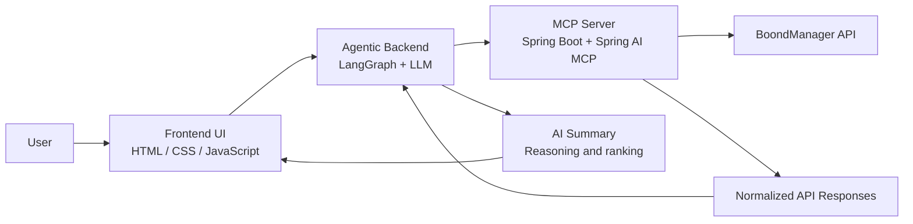
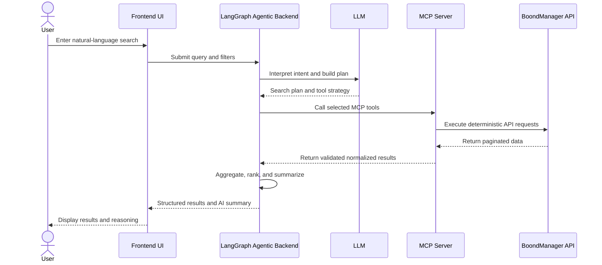

# Sijo AI Agent Architecture

## Purpose

This document describes the target architecture for Sijo's internal AI Agent project.

The goal is to let users perform deep and advanced searches on BoondManager data using natural language. The system connects an LLM-powered agent to BoondManager through an MCP server, while keeping business data access deterministic, auditable, and easy to evolve.

## Scope

The architecture covers three main parts:

- A simple frontend UI for entering search criteria and displaying results.
- An agentic backend built with LangGraph and connected to an LLM.
- An MCP server built with Spring Boot and Spring AI MCP Server Starter, exposing BoondManager capabilities as tools.

The MCP server should remain deterministic and non-intelligent. Reasoning, planning, ranking, and summarization belong in the agentic backend.

## High-Level Architecture



## Request Flow



## Component Responsibilities

### Frontend UI

Responsibilities:

- Provide a simple search interface for user criteria.
- Send natural-language queries and optional filters to the backend.
- Display structured search results.
- Display AI-generated summary, reasoning, and ranking notes.
- Handle loading, empty states, and user-facing errors.

Non-goals:

- No direct BoondManager API access.
- No LLM orchestration.
- No business logic beyond basic form validation and presentation.

### Agentic Backend

Responsibilities:

- Receive user intent from the frontend.
- Use LangGraph to manage agent state and execution flow.
- Connect to an LLM for intent understanding, planning, and summarization.
- Select the appropriate MCP tools.
- Execute tool calls through the MCP server.
- Aggregate, rank, deduplicate, and summarize results.
- Return both structured data and a concise explanation.

Non-goals:

- No direct BoondManager API integration.
- No long-term storage unless needed for later audit or session features.
- No hidden data transformation that should belong to the MCP normalization layer.

### MCP Server

Responsibilities:

- Expose BoondManager endpoints as MCP tools.
- Handle BoondManager authentication.
- Validate tool inputs.
- Manage pagination and API limits.
- Normalize BoondManager responses into stable schemas.
- Return clear deterministic errors.
- Keep tool behavior predictable and testable.

Non-goals:

- No LLM calls.
- No autonomous reasoning.
- No ranking, summarization, or intent interpretation.

## Tool Boundary

The MCP tools should be narrow, explicit, and stable. Example tool categories:

- Search candidates, consultants, resources, companies, contacts, opportunities, and projects.
- Retrieve entity details by ID.
- Search by skills, availability, role, location, seniority, status, or date ranges.
- Resolve related entities, such as candidate-to-company or project-to-contact relationships.

Each tool should define:

- Input schema.
- Required and optional filters.
- Pagination behavior.
- Normalized output schema.
- Error format.

## Example User Queries

- "Find Java developers in Paris who are available within the next month."
- "Show consultants with React and Node.js experience who worked on banking projects."
- "Find active opportunities requiring a senior project manager in Lyon."
- "Which candidates match a data engineer role with Python, SQL, and Azure?"
- "Summarize the best available profiles for this client need."
- "Find companies with recent opportunities related to cybersecurity."
- "Compare the top five matching consultants and explain the ranking."

## Suggested Repository Structure

```text
.
├── docs/
│   └── architecture/
│       └── sijo-ai-agent-architecture.md
├── frontend/
│   ├── index.html
│   ├── styles.css
│   └── app.js
├── agent-backend/
│   ├── README.md
│   ├── src/
│   └── tests/
├── mcp-server/
│   ├── README.md
│   ├── src/
│   └── tests/
└── README.md
```

This structure keeps the UI, agent orchestration, and MCP server independent while making their responsibilities clear to both humans and AI coding agents.

## MVP Roadmap

### Phase 1: Foundation

- Create the frontend search page.
- Create the LangGraph backend skeleton.
- Create the Spring Boot MCP server skeleton.
- Configure BoondManager authentication.
- Define the first normalized response schemas.

### Phase 2: First Search Path

- Implement one high-value BoondManager search tool.
- Connect the agent backend to the MCP server.
- Let the frontend submit a query and display structured results.
- Add basic error handling and empty-state handling.

### Phase 3: Agent Reasoning

- Add intent extraction.
- Add simple planning for tool selection.
- Add result aggregation and ranking.
- Add AI-generated summaries with transparent reasoning.

### Phase 4: Hardening

- Add validation and integration tests around MCP tools.
- Add logging for tool calls and agent decisions.
- Add pagination handling for larger result sets.
- Add safeguards for sensitive data and excessive queries.

## Architecture Principles

- Keep the MCP server deterministic.
- Keep LLM reasoning in the agent backend.
- Prefer explicit tools over generic API pass-through.
- Normalize external API responses before they reach the agent.
- Make results explainable, not just returned.
- Keep the MVP small and useful before adding advanced workflows.
- Design tool schemas so AI coding agents can understand and extend them safely.
- Treat authentication, authorization, and data exposure as first-class concerns.

## Error Handling Principles

- Return structured errors from the MCP server.
- Distinguish validation errors, authentication errors, BoondManager API errors, and no-result cases.
- Let the backend decide how to explain errors to the user.
- Avoid leaking raw provider errors or sensitive request details to the frontend.

## Observability

The MVP should include enough logging to understand:

- The original user query.
- The interpreted intent.
- The selected MCP tools.
- Tool inputs, excluding secrets.
- Tool execution status.
- Result counts.
- Summary generation status.

Logs should support debugging and audit needs without exposing sensitive data unnecessarily.

## Future Extensions

- Multi-step search workflows across candidates, companies, opportunities, and projects.
- Saved searches and reusable search templates.
- Conversation history for iterative refinement.
- User-specific permissions mapped to BoondManager access rules.
- Feedback capture on result quality.
- Advanced ranking strategies using business-specific scoring.
- Export of results to CSV, PDF, or internal reporting tools.
- Scheduled monitoring for new matching profiles or opportunities.
- Additional MCP tools for other internal systems.

## Implementation Notes For AI Coding Agents

- Preserve the separation between frontend, agent backend, and MCP server.
- Do not add intelligence to the MCP server.
- Start with one complete vertical search path before broadening tool coverage.
- Keep schemas explicit and documented near their implementation.
- Favor small, testable components over broad abstractions.
- When extending the system, update this document if responsibilities or boundaries change.
