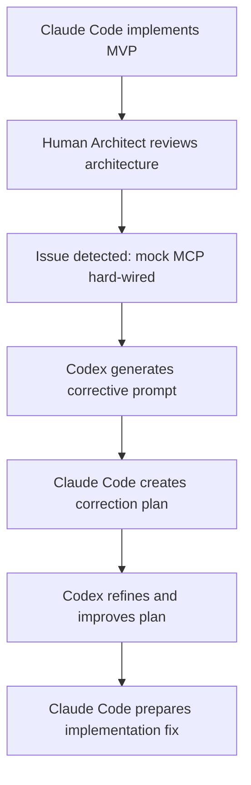

# ADR-002 - MCP Client Wiring And Dependency Injection Review

## Context

The `apps/agent-api` module is designed to orchestrate search workflows through an MCP client abstraction.

The intended architecture was:

- The Agent API depends on an `McpClient` interface, not on a concrete MCP implementation.
- Mock and real MCP clients are selected through environment-driven configuration.
- `settings.use_mock_mcp` controls whether local development uses a mock client.
- `settings.mcp_server_url` defines the real MCP endpoint when mock mode is disabled.
- FastAPI dependency injection keeps transport concerns separate from graph and service logic.

This boundary matters because the Agent API owns reasoning and orchestration, while the MCP server owns deterministic BoondManager tool execution.

## Problem Discovered

During human architectural review of the initial MVP implementation, the MCP client wiring had drifted from the intended design.

The implementation contained:

- A hard-wired `MockMcpClient` inside `app/main.py`.
- A second `MockMcpClient` fallback inside `app/api/dependencies.py`.
- Configuration values such as `settings.use_mock_mcp` and `settings.mcp_server_url` that existed but were not consistently respected by runtime code.

This created dead configuration and made the system appear more configurable than it actually was.

## Why This Was Dangerous

The issue was not just cosmetic. It created real architecture and operational risk:

- Production-like environments could silently serve mock data.
- Operators could set `USE_MOCK_MCP=false` and believe real MCP was enabled when it was not.
- Runtime behavior was hidden inside fallback code instead of explicit configuration.
- Debugging real MCP integration would be confusing because the app could continue working with fake results.
- Environment separation between local, staging, and production was weakened.
- Dependency injection boundaries became ambiguous.

The most dangerous pattern was the silent fallback. Infrastructure dependencies should fail clearly when unavailable or misconfigured; they should not quietly switch to fake data.

## Human Review Process

The issue was found through human architectural review after AI-assisted implementation.

This workflow was effective because each AI tool contributed differently: one generated implementation, the other helped interrogate and refine architectural intent, while the human reviewer kept the system boundary honest.

## Architectural Lesson Learned

AI-generated code still requires architectural review.

The MVP worked, tests passed, and the endpoint returned plausible results. However, the wiring violated the intended dependency boundary. This is a common risk in AI-assisted development: a locally useful shortcut can become embedded as architecture.

Key lessons:

- Configuration must be exercised by runtime code, not merely declared.
- Dependency injection should be explicit and testable.
- Mock implementations must be selected intentionally by environment.
- Silent infrastructure fallbacks hide production risk.
- Passing tests do not prove architectural alignment.
- Architecture boundaries drift easily without review.

## Recommended Best Practices

- Route all infrastructure clients through a single factory or composition root.
- Make mock, local, staging, and production behavior explicit.
- Validate configuration at startup or expose dependency status clearly.
- Avoid fallback behavior that changes data sources silently.
- Keep mock clients available for tests, but out of production runtime paths unless explicitly enabled.
- Test both mock and real dependency selection paths early.
- Separate liveness checks from dependency readiness when operational visibility matters.
- Document the intended dependency boundary near the code that enforces it.

## Future Review Checklist

Use this checklist when reviewing future AI-generated infrastructure or integration code:

- [ ] Are all declared configuration values actually used?
- [ ] Are mock implementations controlled by environment or explicit test injection?
- [ ] Are dependency boundaries respected?
- [ ] Are fallbacks explicit, observable, and safe?
- [ ] Is runtime behavior deterministic for each environment?
- [ ] Are infrastructure dependencies injectable?
- [ ] Can production-like environments accidentally use fake data?
- [ ] Do tests cover both mock and real dependency wiring?
- [ ] Does failure mode behavior match operational expectations?

## Decision Flow

This review is anchored in the [Sijo AI Agent Architecture](../architecture/sijo-ai-agent-architecture.md), which assigns reasoning and orchestration to the Agent API while keeping BoondManager access behind deterministic MCP tools.

The next operational decision is [ADR-003 - Graceful MCP Degradation And Health Strategy](./adr-003-graceful-mcp-degradation-and-health-strategy.md), which builds on explicit MCP wiring to define what happens when the remote MCP dependency is unavailable.

## Conclusion

This review showed why human architectural judgment remains critical in AI-assisted engineering.

AI can produce useful MVP code quickly, but it may optimize for immediate functionality over long-term operational clarity. Human review is needed to protect boundaries, validate configuration behavior, and ensure that working software also matches the intended architecture.
