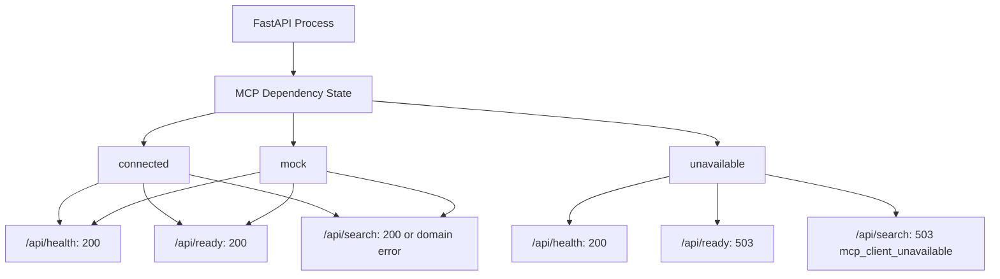
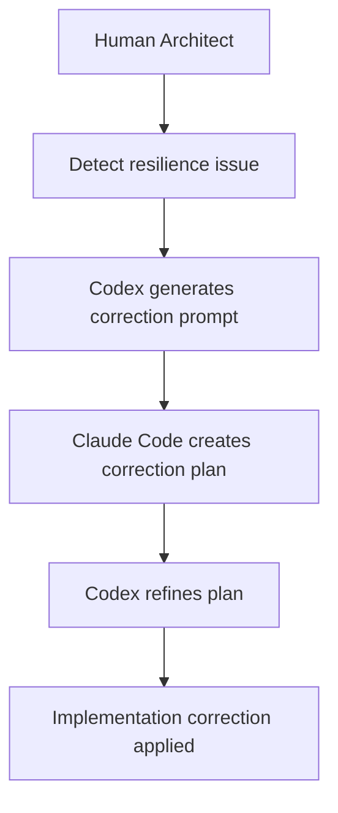

# ADR-003 - Graceful MCP Degradation And Health Strategy

## Context

The `apps/agent-api` service uses FastAPI lifespan startup to initialize application-level dependencies.

After introducing a real remote MCP client, the Agent API attempted to connect to the MCP server during startup. This made the MCP server a hard startup dependency. If the MCP server was unavailable, the FastAPI process failed before any endpoint could respond.

This behavior gave strong fail-fast guarantees, but it also removed operational visibility. When the dependency was down, `GET /api/health` was also down, so operators could not ask the process what dependency had failed.

## Problem Discovered

The original behavior created a resilience gap:

- MCP connection failures aborted Agent API startup.
- `GET /api/health` became unavailable during MCP outages.
- The process could not expose dependency status or diagnostics.
- Local development required the MCP server to be available whenever real mode was enabled.
- Infrastructure failure prevented the API from reporting its own liveness.

The core issue was treating a remote dependency as process-critical instead of readiness-critical.

## Architectural Objective

The desired behavior is:

- The Agent API process should boot when its own code and configuration are valid.
- `GET /api/health` should return `200` when the process is alive.
- MCP dependency state should be explicit and inspectable.
- `GET /api/ready` should represent whether the service can serve search requests.
- `POST /api/search` should return a structured `503` response when MCP is unavailable.
- Mock mode must remain controlled only by configuration.
- The Agent API must not silently fall back to `MockMcpClient`.
- The Agent API must not contain direct BoondManager or Spring-specific logic.

## Final Architectural Approach

MCP connection failures are treated as recoverable startup conditions.

The Agent API tracks dependency state centrally:

- `app.state.mcp_status` stores MCP dependency state.
- `app.state.mcp_client` may be `None` when MCP is unavailable.
- `/api/health` reports process liveness and dependency status.
- `/api/ready` reports operational readiness.
- `/api/search` keeps returning the existing structured `503` error when no usable MCP client is bound.

This preserves deterministic runtime behavior while making dependency state visible.

## Key Architectural Decisions

- Use fail-soft startup for MCP connectivity failures.
- Keep invalid configuration as fail-fast behavior.
- Represent MCP state explicitly as `mock`, `connected`, or `unavailable`.
- Keep mock-vs-real mode environment-driven.
- Do not use silent fallback behavior.
- Treat `/api/health` as liveness.
- Treat `/api/ready` as readiness.
- Use a startup snapshot for dependency status in the MVP.

## Why This Is Important

This design improves operations and debugging:

- Operators can distinguish process health from dependency readiness.
- Kubernetes-style liveness and readiness probes can behave correctly.
- MCP outages become visible instead of hiding behind process failure.
- Search behavior remains deterministic when MCP is unavailable.
- Production environments are protected from accidental mock fallback.
- Debugging local and staging environments becomes simpler.

## Lessons Learned

- Infrastructure dependencies should not always be startup-critical.
- Liveness and readiness are different concepts.
- Health endpoints must survive partial outages.
- Dependency state should be explicit and inspectable.
- Silent fallback behavior hides operational truth.
- AI-generated implementations still require resilience review.

## Future Considerations

Deferred improvements:

- Background MCP health probes.
- Automatic reconnect loop.
- Dynamic transition from `unavailable` to `connected`.
- Circuit breaker behavior for repeated MCP failures.
- Per-request reconnect strategy for expired sessions.
- Richer readiness checks for tool discovery and required tool availability.

These should be added only when operational requirements justify the extra complexity.

## Review Workflow

This design emerged from human architectural review of the AI-assisted implementation.

The workflow helped separate immediate functionality from production-grade operational behavior.

## Related Architecture Decisions

- [ADR-004 - asyncio.CancelledError Escapes Graceful MCP Degradation](./adr-004-asyncio-cancelled-error-mcp-startup.md)

## Conclusion

Graceful degradation matters because an API should be able to explain dependency failure instead of disappearing with it.

Observability matters because operators need reliable signals during partial outages. Human architectural review remains critical in AI-assisted engineering because working code can still encode the wrong operational assumptions.
