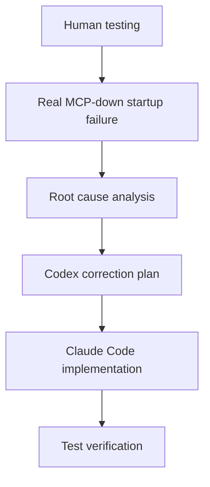

# ADR-004 - asyncio.CancelledError Escapes Graceful MCP Degradation

## Context

ADR-003 introduced graceful MCP degradation for the Agent API. The intended behavior was that the FastAPI process should remain alive when `RemoteMcpClient.connect()` fails, allowing `GET /api/health` to stay reachable and report MCP dependency status.

During real-world testing with the MCP server down, startup still failed. The MCP SDK Streamable HTTP initialization raised `asyncio.CancelledError`, likely from an internal TaskGroup cancellation caused by transport failure.

This exposed a gap in the degradation path.

## Problem Discovered

The failure escaped both defensive layers:

- `RemoteMcpClient.connect()` caught transient `Exception` subclasses and then generic `Exception`.
- FastAPI lifespan also caught generic `Exception` around MCP connection startup.
- `asyncio.CancelledError` was raised during MCP session initialization.
- The error escaped both handlers.
- FastAPI startup aborted.
- `GET /api/health` became unavailable.

This violated the graceful degradation goal from ADR-003.

## Root Cause

`asyncio.CancelledError` inherits from `BaseException`, not `Exception`.

That means handlers such as `except Exception` do not catch it. This matters in async Python because TaskGroup-based libraries may use cancellation internally when a background task fails, a stream closes, or a transport cannot initialize.

In this case, the cancellation was part of MCP SDK startup failure, not an intentional external request to stop the Agent API process.

## Decision

Apply a fix-only change to the MCP startup path.

The decision has two layers:

- `RemoteMcpClient.connect()` explicitly catches startup `asyncio.CancelledError`, closes any partially opened async stack best-effort, and converts the failure to `McpTransientError`.
- FastAPI lifespan defensively re-raises `KeyboardInterrupt` and `SystemExit`, then catches `BaseException` only for MCP startup dependency degradation.

The dependency is then marked unavailable, while the Agent API process stays alive.

## Why This Is Safe

This is safe because the scope is narrow:

- The handling applies to MCP startup initialization only.
- `KeyboardInterrupt` and `SystemExit` are explicitly preserved.
- The search path remains unchanged.
- No silent fallback to `MockMcpClient` is introduced.
- No direct BoondManager or Spring-specific logic is added.

The design treats this `CancelledError` as an internal MCP SDK startup failure, not as a general cancellation policy for all request paths.

## Consequences

Positive outcomes:

- FastAPI survives this MCP startup failure mode.
- `GET /api/health` remains reachable.
- `GET /api/ready` can report MCP as unavailable.
- `POST /api/search` continues returning structured `503 mcp_client_unavailable` responses when no usable MCP client is bound.
- Runtime behavior now matches the graceful degradation design.

Tradeoffs:

- `BaseException` handling must remain tightly scoped.
- This is not a general cancellation-handling policy.
- Mid-flight request cancellation still needs separate design if it becomes relevant.

## Tests Added

Expected test coverage:

- `RemoteMcpClient.connect()` wraps startup `asyncio.CancelledError` as `McpTransientError`.
- FastAPI lifespan marks MCP unavailable when `connect()` raises `asyncio.CancelledError`.
- Existing graceful degradation, readiness, and search error tests continue passing.

The full test suite should pass after the fix.

## Out of Scope

This ADR does not introduce:

- Auto-reconnect.
- Background reprobe.
- Per-request `CancelledError` handling.
- `discover_tools` or `call_tool` cancellation handling.
- Mid-flight request cancellation strategy.
- New endpoints or changed search behavior.

## Review Workflow

## Decision Flow

- Primary context: [ADR-003 - Graceful MCP Degradation And Health Strategy](./adr-003-graceful-mcp-degradation-and-health-strategy.md), because this ADR is a fix to that startup degradation path.
- Guardrail preserved: [ADR-002 - MCP Client Wiring Review](./adr-002-mcp-client-wiring-review.md), because the fix keeps MCP unavailable behavior explicit and does not reintroduce silent mock fallback.
- System context: [Sijo AI Agent Architecture](../architecture/sijo-ai-agent-architecture.md), which keeps Agent API orchestration separate from deterministic MCP tool execution.

## Conclusion

Graceful degradation must handle async runtime edge cases, not only ordinary exceptions.

Python async cancellation semantics are subtle, especially when third-party libraries use TaskGroups internally. This finding reinforces that AI-generated code requires real runtime testing and human architectural validation, even when the initial design is sound.
