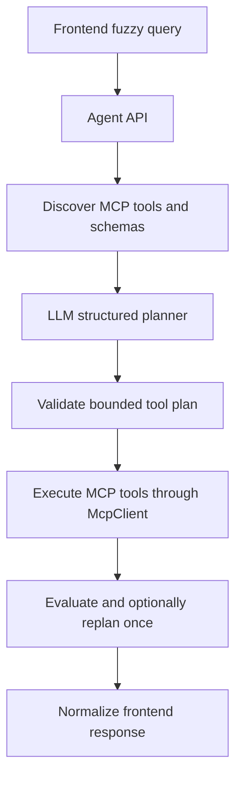
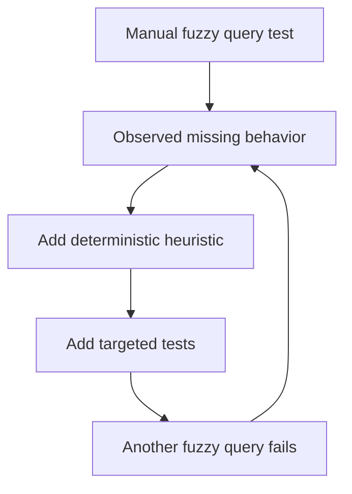
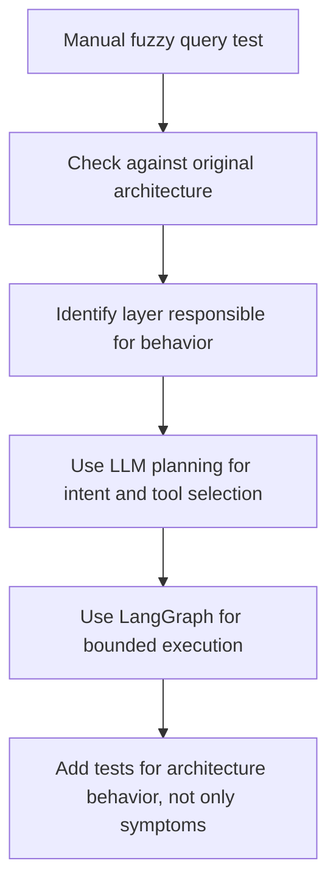

# ADR-005 - Agent Planner Drift From LLM-Led Architecture

## Context

The original Sijo AI Agent architecture expects fuzzy frontend search requests to be interpreted by an LLM-powered Agent API.

The intended flow is:

- The frontend sends natural-language criteria.
- The Agent API discovers available MCP tools and schemas.
- The LLM receives the user query, filters, tool names, descriptions, and input schemas.
- The LLM interprets intent and proposes a bounded tool plan.
- LangGraph validates, executes, evaluates, and summarizes the plan.
- MCP remains the only path to BoondManager data.

This keeps reasoning in the Agent API while keeping BoondManager access deterministic and tool-driven.

## What Happened

During an integration and debugging session, the implementation improved several important capabilities:

- Real MCP client wiring and graceful dependency behavior.
- MCP tool discovery through `/api/mcp/tools`.
- Candidate detail lookup by ID.
- Frontend-oriented candidate card responses.
- Candidate result normalization.
- Search result enrichment through detail and technical-document tools.
- Dictionary resolution experiments.
- Broad-search guardrails.
- Development-only MCP debug calls.
- Structured workflow logs.

Each change addressed a real symptom observed during testing. However, the sequence became a symptom-fixing loop: each new fuzzy query exposed another missing heuristic, and the planner gained more deterministic rules instead of moving toward LLM-led planning.

## Why The Deviation Happened

The deviation was caused by a sequence of locally reasonable fixes that accumulated into the wrong planning architecture.

Key contributing factors:

- Concrete `curl` failures drove the work. Each failing query encouraged a narrow fix to make the next request pass.
- No LLM planner existed yet, so the deterministic planner became the only available place to put search intelligence.
- Integration testing focused on MCP connectivity, tool execution, and result normalization before re-checking who should own planning.
- The original mock-era planner still used concepts such as `search_consultants`, so real MCP tools like `searchCandidates` were patched into the old planning model.
- Prompts increasingly asked for deterministic behavior fixes, such as keyword extraction, candidate ID detection, dictionary mapping, and fallback search handling.
- Tests were added around these deterministic fixes, which made the rules more stable but did not prove alignment with the original LLM-led architecture.
- AI coding agents tend to optimize for the current requested behavior unless the prompt explicitly reasserts the architectural responsibility boundary.

The root issue was sequencing: MCP infrastructure work was valid, but the LLM planner should have become the next milestone before adding more search-specific heuristics.

## Deviation

The Agent API drifted from the target agentic design.

Instead of:

```text
LLM interprets intent and proposes a tool plan from discovered MCP tools.
```

the system increasingly behaved like:

```text
Hard-coded keyword extraction and tool rules decide which MCP tools to call.
```

This was not a failure of the MCP integration. It was an architecture drift in the planning layer.

## Why This Was Not Good

The deterministic planner created short-term progress but weakened the intended design:

- Every new fuzzy query required another heuristic.
- Tool-specific patches hid the larger absence of an LLM planning step.
- Passing tests proved local behavior, not architectural alignment.
- Natural-language search quality became limited by hand-written extraction rules.
- The Agent API risked becoming a rules engine instead of an LLM-orchestrated agent.
- The MCP tool descriptions and schemas were discovered, but not yet used as primary planning context for the LLM.

The main issue was procedural: we kept fixing visible symptoms before re-checking the original architecture.

## What Remains Valuable

The work should not be rolled back wholesale.

These pieces are still useful and should be preserved:

- MCP client abstraction and real remote MCP wiring.
- Mock-vs-real configuration.
- `/api/health` and `/api/ready`.
- Graceful MCP degradation.
- `/api/mcp/tools` for tool discovery sanity checks.
- Environment-gated MCP debug endpoint.
- Frontend response contract.
- Candidate card normalization.
- Bounded enrichment and ranking mechanics.
- Structured logging and observability.
- Tests that prevent raw MCP payload leaks, silent mock fallback, and unbounded execution.

The correction is not to remove this infrastructure. The correction is to replace the primary planning intelligence.

## Decision

Do not roll back the integration infrastructure.

Refactor the planning layer so real-mode planning is driven by an LLM using discovered MCP tool metadata:

- The LLM receives the user query, filters, available MCP tools, descriptions, and input schemas.
- The LLM returns a structured tool plan.
- LangGraph validates the plan before execution.
- LangGraph enforces bounded execution and bounded replanning.
- Deterministic heuristics remain only as fallback, test support, or local development helpers.
- MCP remains the only BoondManager access path.

The Agent API should be LLM-led for fuzzy search, but deterministic in execution safety.

## Future Direction

The corrected Agent API flow should be:



The LLM owns interpretation and planning. LangGraph owns validation, orchestration, bounded execution, and state transitions. The MCP server owns deterministic BoondManager tool execution.

## Review Workflow

The problematic loop looked like this:



The corrected workflow should be:



## Lessons Learned

- AI-assisted implementation can optimize locally while drifting architecturally.
- Passing tests are not enough when the tests encode the wrong design direction.
- Tool discovery is only valuable if the planner actually uses tool metadata.
- Fuzzy natural-language search should not be rebuilt as a growing keyword rules engine.
- Architecture review should happen after each symptom fix, not only after many fixes accumulate.
- Keep useful infrastructure, but correct the layer where the responsibility drifted.

## Decision Flow

- System context: [Sijo AI Agent Architecture](../architecture/sijo-ai-agent-architecture.md), which defines the Agent API as LLM-powered and responsible for planning.
- Builds on: [ADR-002 - MCP Client Wiring Review](./adr-002-mcp-client-wiring-review.md), because LLM planning still depends on explicit MCP client wiring.
- Builds on: [ADR-003 - Graceful MCP Degradation And Health Strategy](./adr-003-graceful-mcp-degradation-and-health-strategy.md), because the planner must preserve dependency status behavior.
- Builds on: [ADR-004 - asyncio.CancelledError Escapes Graceful MCP Degradation](./adr-004-asyncio-cancelled-error-mcp-startup.md), because startup resilience remains part of the execution foundation.

## Conclusion

The afternoon's work improved the integration foundation but exposed a planning-layer drift.

The right correction is not a rollback. The right correction is to keep the reliable MCP and response infrastructure, then restore the original architecture by making the LLM the primary real-mode planner over discovered MCP tools.
