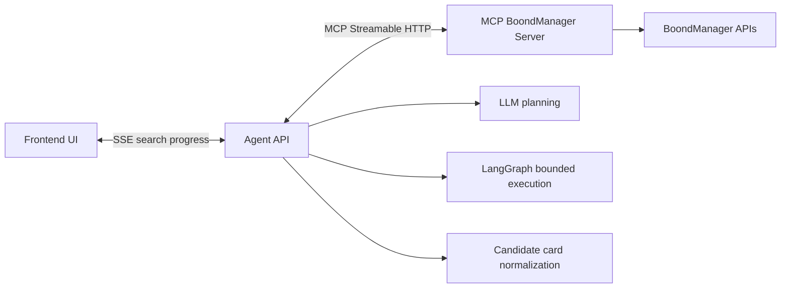

# ADR-006 - User-Facing Search Streaming Strategy

## Context

ADR-005 restored the intended direction for fuzzy search: the Agent API should use an LLM planner over discovered MCP tools, while LangGraph validates and executes a bounded plan.

Once planning and execution become multi-step, a synchronous response is no longer enough for product feedback or debugging. The frontend needs to see progress as the agent discovers tools, creates a plan, calls MCP tools, normalizes results, optionally replans, and returns final candidate cards.

At the same time, the system already uses MCP Streamable HTTP between the Agent API and the MCP BoondManager server.

These are different streaming concerns:

- Frontend to Agent API: user-facing agent progress.
- Agent API to MCP Server: internal MCP protocol transport.

## Problem

There was a risk of confusing the two layers and exposing MCP Streamable HTTP directly to the frontend.

That would be the wrong boundary. The frontend should not need to understand:

- MCP protocol semantics.
- MCP tool sessions.
- Raw tool schemas.
- Raw BoondManager payloads.
- Tool execution details beyond safe user-facing progress.

The Agent API owns planning, orchestration, normalization, summarization, and safety. The frontend should receive product-level events, not MCP protocol traffic.

## Decision

Keep MCP Streamable HTTP internal between the Agent API and the MCP server.

Add a separate user-facing streaming endpoint:

```text
POST /api/search/stream
```

Use Server-Sent Events style streaming for the MVP.

Keep the existing synchronous endpoint:

```text
POST /api/search
```

The streaming endpoint should emit sanitized agent execution events such as:

- `search_started`
- `tools_discovered`
- `plan_created`
- `plan_validated`
- `tool_call_started`
- `tool_call_completed`
- `results_normalized`
- `replan_requested`
- `replan_created`
- `candidate_cards_partial`
- `final_response`
- `search_failed`

The stream should expose structured progress, not private reasoning.

## Architecture



The frontend sees agent-level progress events. The Agent API remains the protocol boundary and converts MCP execution into UI-safe events and final candidate cards.

## Why SSE First

SSE-style streaming is appropriate for the MVP because search progress is primarily server-to-client:

- The frontend submits one search request.
- The Agent API streams progress events.
- The Agent API ends with a final response.

SSE is simpler than WebSocket for this shape of interaction and works well for progressive status updates.

WebSocket can be considered later if the product needs bidirectional controls such as:

- User cancellation.
- Human approval before tool calls.
- Live query steering.
- Interactive clarification questions.

## Safety Rules

Allowed in streaming events:

- Conversation ID.
- Planner mode.
- Tool names.
- Tool input schema keys.
- Sanitized planned inputs.
- Plan reasons from structured planner output.
- Tool call status.
- Latency and result counts.
- Candidate IDs.
- Normalized candidate cards.
- User-safe warnings and errors.

Not allowed in streaming events:

- LLM chain-of-thought.
- Raw MCP response payloads.
- Raw BoondManager payloads.
- API keys or secrets.
- Internal stack traces.
- Hidden debug objects that the frontend should not depend on.

## Consequences

Positive outcomes:

- The frontend can show live search progress.
- Developers can debug whether failure occurred during planning, tool execution, normalization, or final response generation.
- MCP protocol details remain internal.
- The existing synchronous endpoint remains available for simple clients.
- Streaming behavior aligns with LLM-led multi-step planning.

Tradeoffs:

- The workflow needs an event emitter or async generator abstraction.
- Tests must cover event order, safety, and backward compatibility.
- The team must maintain a stable user-facing event contract separate from MCP internals.

## Implementation Guidance

The streaming endpoint should reuse the same core orchestration as `POST /api/search`.

FastAPI should remain thin:

- Validate the request.
- Resolve dependencies.
- Return a streaming response.
- Delegate search execution to the service or workflow layer.

LangGraph and the service layer should emit structured events at meaningful boundaries:

- Search start.
- Tool discovery.
- LLM plan creation.
- Plan validation.
- MCP call start and completion.
- Result normalization.
- Enrichment and ranking.
- Replanning decisions.
- Final response.
- Safe failure.

Every successful stream should end with `final_response`.

## Out of Scope

This decision does not introduce:

- WebSocket.
- Frontend implementation.
- Direct frontend access to MCP.
- Raw MCP protocol exposure.
- Raw BoondManager payload exposure.
- LLM chain-of-thought streaming.
- Unbounded agent loops.
- Human-in-the-loop approval.

## Decision Flow

- System context: [Sijo AI Agent Architecture](../architecture/sijo-ai-agent-architecture.md), which keeps the frontend, Agent API, and MCP server responsibilities separate.
- Builds on: [ADR-005 - Agent Planner Drift From LLM-Led Architecture](./adr-005-agent-planner-drift-from-llm-architecture.md), because streaming exposes the visible progress of LLM-led planning and bounded execution.
- Preserves: [ADR-002 - MCP Client Wiring Review](./adr-002-mcp-client-wiring-review.md), because MCP access remains behind the Agent API.
- Preserves: [ADR-003 - Graceful MCP Degradation And Health Strategy](./adr-003-graceful-mcp-degradation-and-health-strategy.md), because streaming must report unavailable dependencies safely.

## Conclusion

User-facing search streaming should be an Agent API concern, not an MCP protocol exposure.

MCP Streamable HTTP remains the internal tool transport. The frontend receives sanitized SSE-style progress events that explain what the agent is doing without exposing raw tool payloads, private reasoning, or infrastructure internals.
